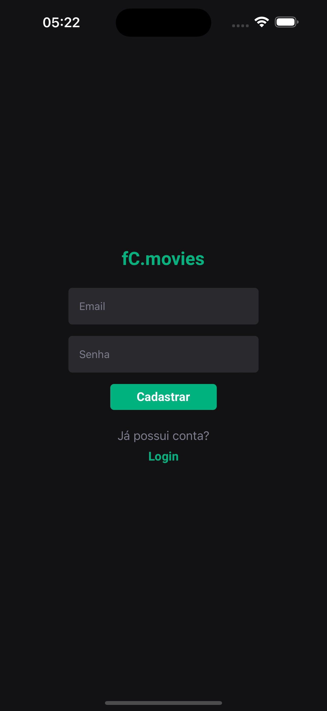
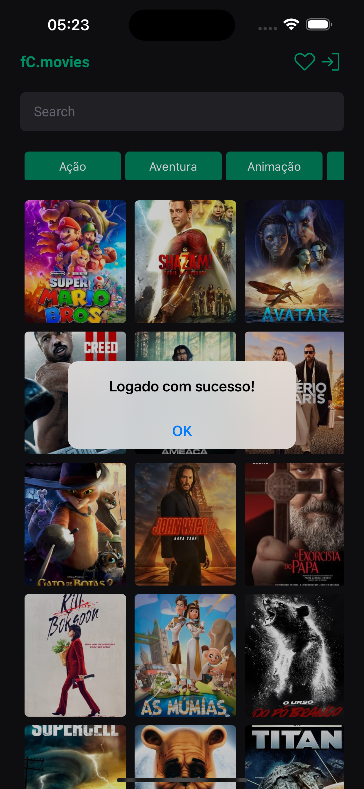
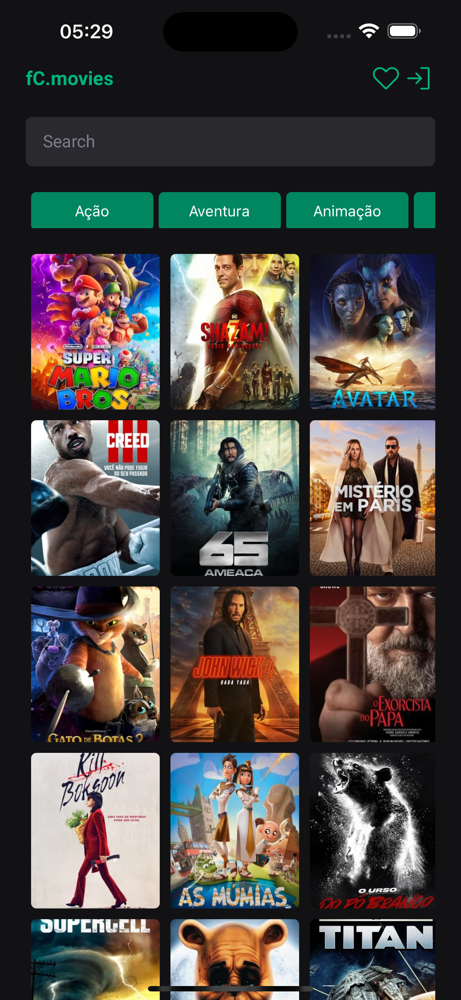
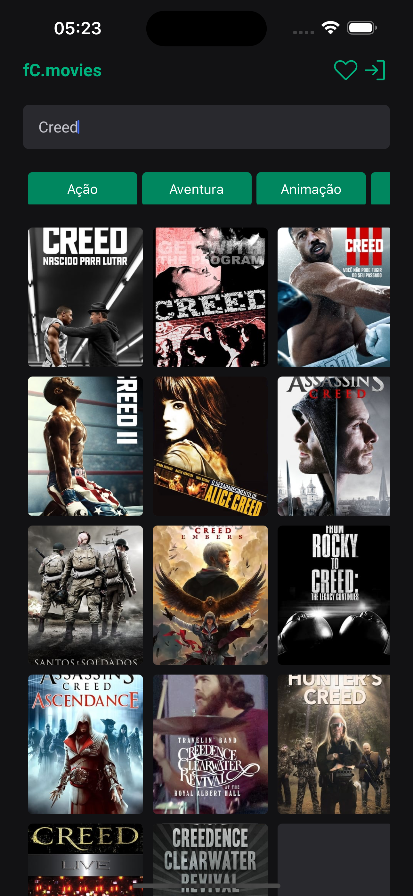
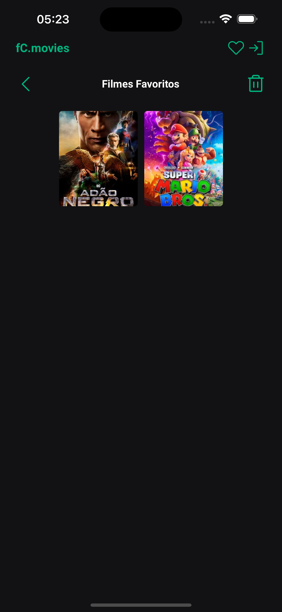

<div align="center">
    
</div>

# fC.movies

## O que é necessário para rodar essa aplicação?

- [Node.js](https://nodejs.org/en) em versões LTS;
- [Yarn](https://yarnpkg.com/);
- [Git](https://git-s);
- [Xcode](https://developer.apple.com/xcode/);
- [Cocoapods](https://cocoapods.org/);
- [Watchman](https://facebook.github.io/watchman/) para usuários de macOS ou Linux;
- [Expo CLI](https://docs.expo.dev/get-started/installation/);

## Tecnologias utilizadas

- [TypeScript](https://www.typescriptlang.org/);
- [React-Native](https://reactnative.dev/);
- [Expo](https://expo.dev/);
- [Firebase](https://firebase.google.com/?hl=pt-br);
- [Axios](https://axios-http.com/);
- [Redux](https://redux.js.org/);
- [React Navigation](https://reactnavigation.org/);
- [React Hook Form](https://react-hook-form.com/);
- [Zod](https://zod.dev/);
- [Phosphor Icons](https://phosphoricons.com/);
- [Styled-Components](https://styled-components.com/);

## Variáveis de Ambiente

Para rodar esse projeto, você vai precisar adicionar as seguintes variáveis de ambiente no seu .env

**API**

`MOVIE_DB_API_KEY`

## Rodando localmente

Clone o projeto

```bash
  git clone https://github.com/flpcastro/fc-movies.git
```

Entre no diretório do projeto

```bash
  cd fc-movies
```

Abra a sua IDE

```bash
  code .
```

Instale as dependências

```bash
  yarn
```

Entre na pasta ios

```bash
  cd ios/
```

Baixe as dependencias do Cocoapods

```bash
  pod install
```

Volte para a pasta raiz

```bash
  cd ..
```

Inicie o emulador iOS

```bash
  yarn ios
```

## Funcionalidades

- [x] Exibir a lista de filmes (Home);
- [x] Ao clicar em uma imagem do filme na tela inicial, aparecer os detalhes do mesmo;
- [x] Barra de busca com base no texto digitado pelo usuário;
- [x] Filtrar filmes por gênero;
- [x] Permitir que o usuário adicione filmes à uma lista de favoritos.
- [x] O aplicativo deve ser capaz de exibir a lista de filmes favoritos offline.
- [x] Permitir que o usuário compartilhe um filme nas redes sociais, utilizando a lib de compartilhamento do React Native.
- [x] Ter um sistema de login utilizando o Firebase ou outra plataforma similar.

## Prints

<div >
  
  
  
  
  
  
  
</div>
